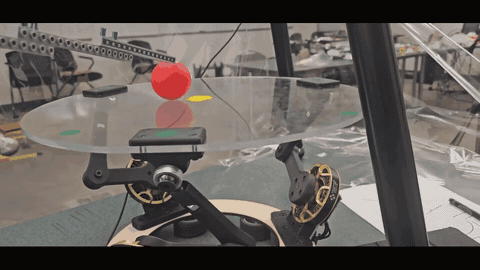
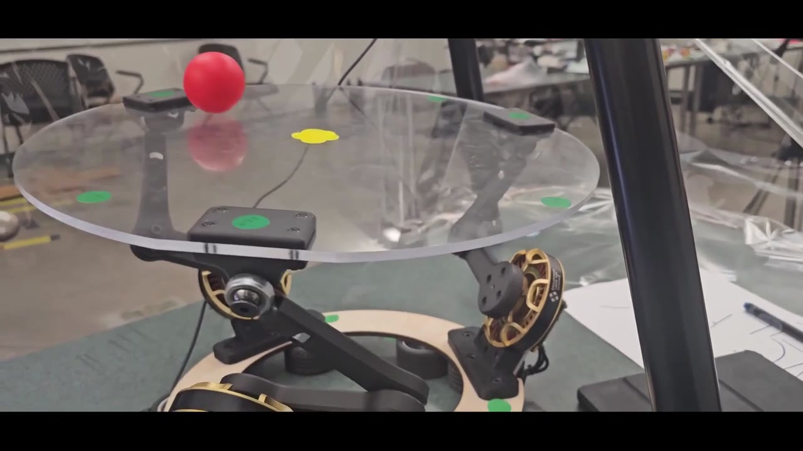
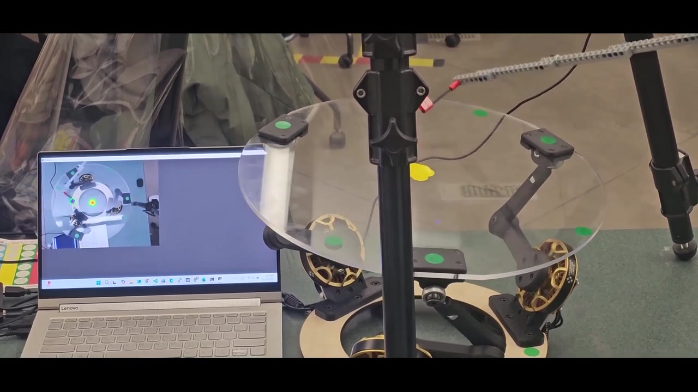
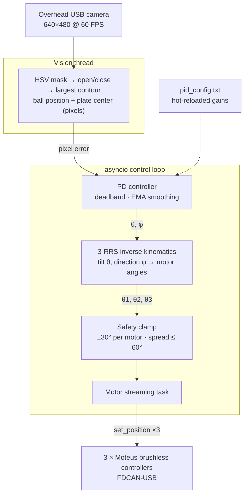

# Ball-Balancing Robot

A vision-guided 3-RRS parallel manipulator that keeps a ball centered on a tilting plate. The system combines real-time OpenCV tracking, closed-form inverse kinematics, and PD control on three Moteus brushless actuators.

<p align="center">
  
</p>

<p align="center">
  <a href="media/demo-full.mp4">Full demo video (66 s)</a>
</p>

## Overview

Balancing a ball on a plate is an unstable, non-linear control problem. The ball keeps accelerating unless the plate reacts fast enough, and every millisecond of camera or actuator latency shows up as overshoot. This project closes the loop on physical hardware:

```
overhead camera → ball + plate-center detection → pixel error → PD controller
      → desired plate tilt (θ, φ) → 3-RRS inverse kinematics → motor angles → Moteus (FDCAN)
```

The robot was built and tuned on real hardware. It is not a simulation.

<p align="center">
  
  
</p>

## Hardware

| Component | Details |
|---|---|
| Mechanism | 3-RRS parallel manipulator, legs 120° apart, 3D-printed linkages, acrylic plate |
| Actuators | 3 × Moteus brushless controllers on a shared FDCAN-USB bus |
| Sensing | Overhead USB camera, 640×480 requested at 60 FPS, centered over the plate |
| Geometry | Platform radius 200 mm, base radius 148 mm, links 117 mm / 93 mm, nominal height 140 mm |

## Architecture



Perception runs on its own thread, so frame capture never blocks control. Control and motor streaming run as two concurrent `asyncio` tasks. The controller updates the target angles, and a separate task streams them continuously to all three motors with `asyncio.gather`.

## Technical Highlights

**Closed-form 3-RRS inverse kinematics** (`src/rob_kin.py`)
- The desired tilt is expressed as a plate normal in spherical form (tilt θ, direction φ).
- For each leg, the solver finds the platform ball-joint position, then solves a quadratic for the knee joint constrained to that leg's vertical plane. The motor angle comes from `atan2`.
- A bisection search (`max_theta`) finds the largest tilt that is still geometrically reachable at a given plate height.

**Vision without camera calibration** (`src/tracker.py`)
- The ball is segmented with two HSV hue bands, because red wraps around the hue circle.
- Morphological open/close removes noise, and the centroid of the largest contour becomes the ball position.
- A yellow marker at the plate center is latched as "home" on first detection. Error is computed relative to it, so no intrinsic or extrinsic calibration is needed as long as the camera stays aligned over the plate.

**Control law** (`src/PID_error.py`)
- PD control on pixel error.
- The integral term is deliberately omitted. Errors in opposite quadrants cancel in a single global integral even though the plate must respond differently, so accumulating error is not meaningful here.
- A 25 px deadband suppresses jitter when the ball is near the center.
- An exponential moving average (α) smooths the derivative-driven output.
- Output magnitude maps to tilt through a saturating `10·tanh(β·r)` curve, capped at 10°. A higher gain multiplier kicks in when the ball is far from center.

**Live tuning**
- Gains (`KP`, `KD`, `ALPHA`, `BETA`, ...) are reloaded from `pid_config.txt` whenever the file changes, so the controller can be retuned while the robot runs without restarting.
- `pid_config.txt` also contains the tuning guide used during development.

**Safety limits** (`src/control.py`)
- Each motor command is clamped to ±30°.
- A command is rejected if the spread between motors exceeds 60°, which prevents mechanically impossible poses.
- If tracking loses the ball (error above 250 px), the plate returns to level.

## Results

- Across 10 balancing trials, the robot kept the ball near the plate center in about 7.
- It recovered from gentle pushes and recentered balls released at different positions on the plate.
- The main failure mode was mechanical: small vibrations shifted the robot relative to the camera. That misaligned the plate center, and the gains then needed retuning.

## Tech Stack

Python · OpenCV · NumPy · asyncio · threading · [moteus](https://github.com/mjbots/moteus) Python API · FDCAN

## Project Structure

```
src/
  main.py          entry point: starts vision, control and motor tasks
  tracker.py       camera thread: HSV segmentation, contour tracking
  PID_error.py     PD controller with deadband, EMA smoothing, hot-reloaded gains
  pid_config.txt   live-tunable gains + tuning guide
  rob_kin.py       closed-form 3-RRS inverse kinematics
  control.py       Moteus interface, safety clamping, motor streaming
  PID.py           earlier PID variant (kept for reference)
  bounce.py        experimental sinusoidal bounce mode (not used in the demo)
tools/
  hsv_tuner.py     trackbar utility for picking HSV thresholds
media/             demo GIF, full video, photos
```

## Running It

This runs on specific hardware: three Moteus controllers on IDs 1–3 behind an FDCAN-USB adapter, plus a USB camera.

```bash
pip install -r requirements.txt
python tools/hsv_tuner.py   # optional: pick HSV ranges for your lighting
cd src
python main.py              # run from src/ so pid_config.txt is found
```

The camera index is set in `tracker.py` (`cv2.VideoCapture(1, cv2.CAP_DSHOW)` on Windows).

## What I'd Improve Next

- Estimate ball velocity with a Kalman filter instead of differencing noisy pixel positions.
- Replace pixel-space error with a homography to plate coordinates, so bumping the camera no longer requires retuning.
- Measure end-to-end latency (frame capture to motor command) and compensate for it.
- Add a unit-tested IK module with a forward-kinematics round-trip check.

## Credits

- The 3-RRS inverse kinematics follows the derivation in [George Wang's 3-RRS write-up](https://www.george-yuanji-wang.xyz/blog/3rrs).
- Motor control uses the [mjbots moteus](https://mjbots.github.io/moteus/reference/python/) Python library.
- The camera-thread scaffold was adapted from provided starter code. The detection pipeline was rewritten to use contour-based tracking.

## License

MIT
